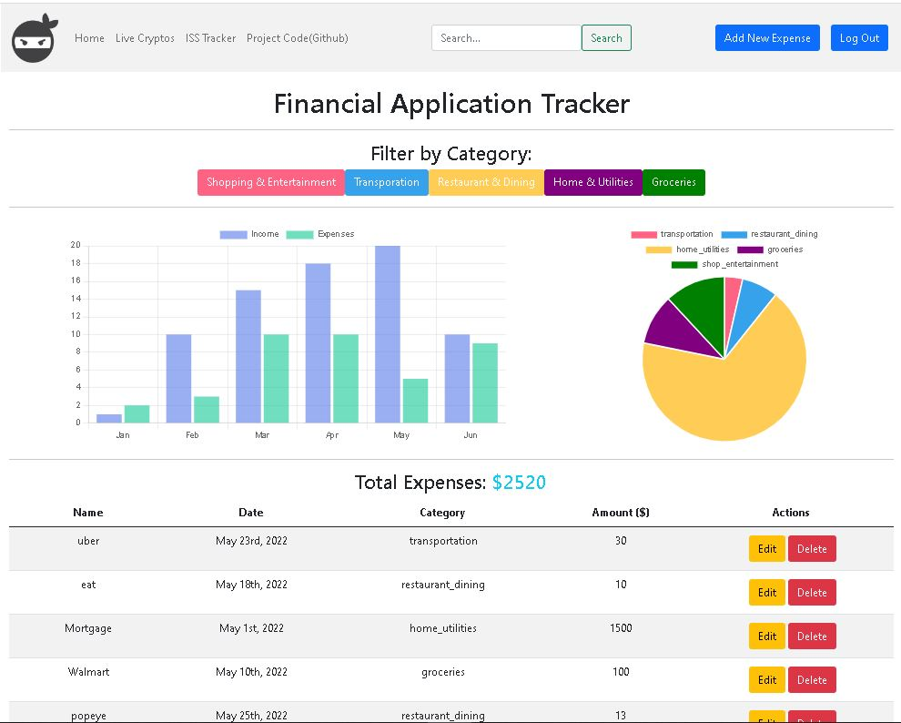
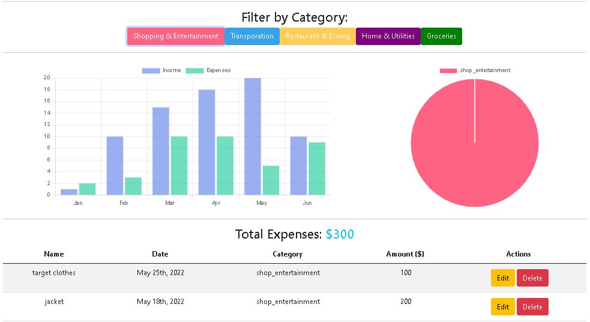
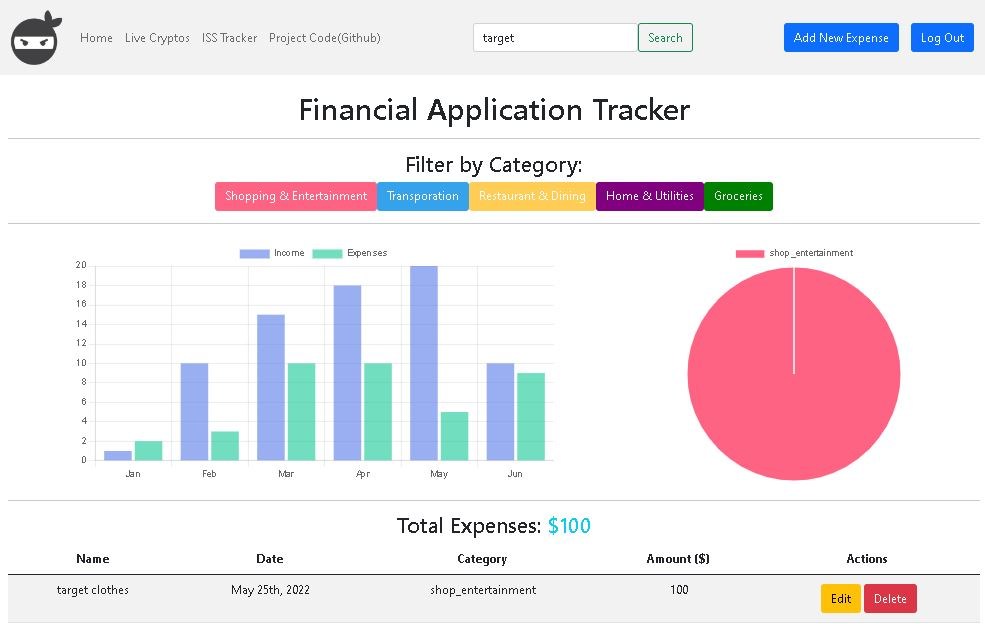
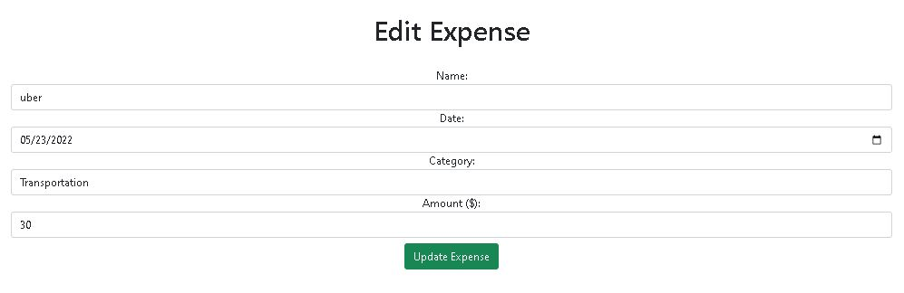

```Finance Tracker Application Project
1. Login reg
2. Dashboard- show all the logged in users expenses
3. Form to create a new expense
    1. Name (eg: chipotle)
    2. Date (filter by a field)
    3. Category
    4. Amount
4. Full crud functionality for expenses
5. Show expenses by filtering by category
6. Show expenses by filtering by date range
7. Have a page where you can show your expenses in a pie chart (by category)


1. As a user, I want to be able to create an expense and specify the name, date, category and amount of the expense
2. As a user, I want to be able to see all the expenses in the dashboard
3. As a user, I want to be able to filter the expenses by category
4. As a user I want to be able to filter the expenses by date range or month
5. As a user I want to be able to see a chart of my expenses by category

Working Progress on Login/reg:
Login reg part 1- Pre requisites and basic project setup	https://youtu.be/kSo3Jzsa6DU
Login reg part 2- Using mongoose virtuals to work with confirm password validations and to hash passwords before saving users to db	https://youtu.be/g_W7K_JYCKE
Login reg part 3- Build out controllers register function in backend and test it using postman	https://youtu.be/XAN6m2hljaw
Login reg part 4- putting our secret key in env file (dotenv module)	https://youtu.be/K7owJDnCp48
Login reg part 5- enabling cookie parser	https://youtu.be/xJTONAkq8gk
Login reg part 6- Finish building out register and login methods in controllers in backend	https://youtu.be/wT6D218B6Go
Login reg part 7- Importing jsonwebtoken and bcrypt in controllers and explaination of what they do	https://youtu.be/RTprViwxRGI
Login reg part 8- comparing async await way versus the nested promises way of building out the login function	https://youtu.be/r76d9zr53fA
Login reg part 9- build out the client on the front end	https://youtu.be/7LGZVOGGuK8
Login reg part 10- getting registration to work full stack	https://youtu.be/TsyMm0ooCvw
Login reg part 11- cookie error solved!	https://youtu.be/gGmVgErtAiY
Login reg part 12- validation on registration form	https://youtu.be/_bdzzt0OTEE
Login reg part 13- dashboard page setup with routes	https://youtu.be/WzFsd5w07Is
Login reg part 14- no duplicate emails	https://youtu.be/NnDhI71LoWE
Login reg part 15- login an existing user	https://youtu.be/8VgdDOn4vaM
Login reg part 16- Get logged in user info in dashboard and redirect unauthorized users to login form	https://youtu.be/S4ZU6DwkoT0
Login reg part 17- Logout	https://youtu.be/E0ZK70IVom4


Multiple tables in one project (Multiple collections)	https://youtu.be/5RhyBdkTtTI

One to Many relationships in mongoose	https://youtu.be/0l3yX-PcMRE

Filter feature with buttons to select the filter (eg: Amazon- filter by nike products only)	https://youtu.be/QG6o7ZS3TsQ

Chart JS (Self sufficiency series--> using purely google and docs)	https://youtu.be/Gvdd9KHRkxE```